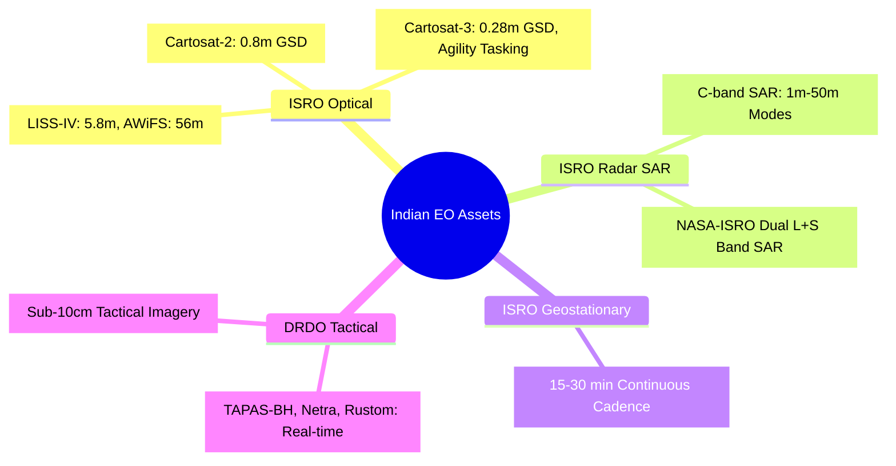
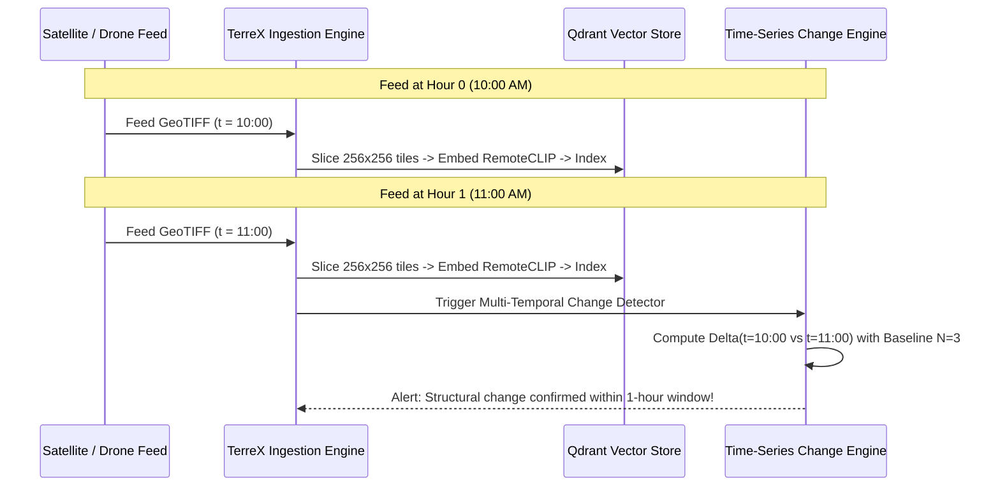

# TerreX Satellite Data & Earth Observation Guide

This document provides a comprehensive technical and operational reference on satellite earth observation (EO) data, sensor physics, orbital cadences, data formats, and how the **TerreX** platform processes multi-temporal imagery for defense, intelligence, and civil infrastructure monitoring.

---

## 1. The Core Fundamentals: The 4 Satellite Resolutions

Every satellite dataset is governed by four primary physical resolutions:

```
┌─────────────────────────────────────────────────────────────────────────────┐
│                          THE 4 EO RESOLUTIONS                               │
├──────────────────────┬──────────────────────┬───────────────────────────────┤
│ 1. SPATIAL           │ 2. TEMPORAL          │ 3. SPECTRAL & 4. RADIOMETRIC  │
│ Ground pixel size    │ Revisit interval     │ Wavelength channels & bit     │
│ (10m vs 30cm)        │ (5 days vs 1 hour)   │ depth precision (8/12/16-bit) │
└──────────────────────┴──────────────────────┴───────────────────────────────┘
```

| Resolution Type | What It Means | Real-World Example | Impact on Change Detection |
| :--- | :--- | :--- | :--- |
| **Spatial Resolution** | Ground Sampling Distance (GSD)—the real-world ground size represented by 1 image pixel. | **Sentinel-2:** $10\text{m} \times 10\text{m}$ / pixel<br>**Cartosat-3:** $0.28\text{m} \times 0.28\text{m}$ / pixel | Determines whether you detect large land clearing (10m) vs individual vehicles/bunkers (sub-meter). |
| **Temporal Resolution** | Revisit cadence—how often a satellite system passes over the exact same point on Earth. | **Sentinel-2:** 5 days (constellation)<br>**Landsat-9:** 16 days<br>**DRDO UAV / HAPS:** Minutes to Hours | Determines the time precision of the "earliest supported observation" for change onset dates. |
| **Spectral Resolution** | Number and bandwidth of electromagnetic wavelengths captured by the sensor. | **Phone Camera:** 3 bands (RGB)<br>**Sentinel-2:** 13 bands (RGB, NIR, Red-Edge, SWIR)<br>**Hyperspectral:** 100–300 narrow bands | Enables chemical/material identification: chlorophyll vigor (NDVI), water moisture (NDWI), concrete (NDBI). |
| **Radiometric Resolution** | Sensor sensitivity to subtle differences in reflected radiation, measured in bit-depth. | **8-bit:** 256 levels ($2^8$)<br>**12-bit:** 4,096 levels ($2^{12}$)<br>**16-bit:** 65,536 levels ($2^{16}$) | Allows detection of subtle targets inside dark cloud shadows or deep water bodies. |

---

## 2. Sensor Modalities: Optical vs. Radar (SAR)

```
        OPTICAL SENSORS (Passive)                  RADAR / SAR SENSORS (Active)
        Uses solar light reflection               Emits microwave pulses & measures echo
                 ☀️                                                 📡
                 │                                                  │ ╲
                 ▼                                                  │  ╲ 
            ┌─────────┐                                        ┌─────────┐
            │ Clouds  │ ❌ BLOCKED                             │ Clouds  │ ✅ PENETRATES
            └─────────┘                                        └─────────┘
                 │                                                  │
                 ▼                                                  ▼
         🌳 🏢 🌊 Ground                                    🌳 🏢 🌊 Ground
```

| Sensor Modality | Physics & Mechanism | Strengths | Limitations | Representative Missions |
| :--- | :--- | :--- | :--- | :--- |
| **Optical (Multispectral / VHR)** | **Passive sensor:** Measures reflected ambient sunlight across visible, near-infrared (NIR), and shortwave-infrared (SWIR) spectra. | • Intuitive human interpretation<br>• High-resolution true color<br>• Vegetation health via NDVI<br>• Material spectral signatures | • Blind during nighttime<br>• 100% blocked by clouds, fog, dense haze, and smoke | **Sentinel-2**, **Cartosat-2/3**, **Landsat 8/9**, **WorldView-3**, **PlanetScope** |
| **Synthetic Aperture Radar (SAR)** | **Active sensor:** Transmits microwave radio pulses (C-band, X-band, L-band) and records the coherent backscatter amplitude & phase. | • **All-weather 24/7 day & night**<br>• Penetrates monsoon clouds & smoke<br>• Detects surface roughness, metal structures, and flood extents | • Speckle noise requires filtering<br>• Non-intuitive visual interpretation<br>• Radar shadow and layover in mountainous/tall urban terrain | **Sentinel-1 (C-band)**, **RISAT-1A / EOS-04 (C-band)**, **NISAR (L+S band)**, **Capella / ICEYE (X-band)** |
| **Thermal Infrared (TIR)** | **Passive emission:** Measures thermal radiation emitted directly by earth objects ($8\text{–}14\,\mu\text{m}$). | • Heat signatures<br>• Industrial activity / thermal pollution<br>• Nighttime thermal differences | • Lower spatial resolution ($60\text{–}100\text{m}$)<br>• Attenuated by moisture/clouds | **Landsat TIRS**, **INSAT-3D/3DR (Imager/Sounder)** |

---

## 3. Comprehensive Satellite Catalog

### 3.1. Indian Sovereign Assets (ISRO & DRDO)



1. **Cartosat-3 (ISRO - High-Resolution Optical):**
   * **Spatial Resolution:** $0.28\text{m}$ Panchromatic, $1.12\text{m}$ 4-band Multispectral.
   * **Orbit:** Sun-synchronous LEO (~505 km altitude).
   * **Agility:** High-maneuverability steering (off-nadir pitch and roll) for targeted point-of-interest imaging.
   * **Use Case:** Defense reconnaissance, sovereign urban monitoring, strategic infrastructure analysis.

2. **RISAT-1A / EOS-04 (ISRO - All-Weather C-Band Radar):**
   * **Spatial Resolution:** $1\text{m}$ (High-Resolution Spotlight), $3\text{m}\text{–}25\text{m}$ (Stripmap), $50\text{m}$ (ScanSAR).
   * **Polarization:** Dual / Hybrid Polarimetry (Circular Tx, Linear Rx).
   * **Use Case:** Border security, cloud-covered monsoon surveillance, flood mapping.

3. **INSAT-3D / 3DR / 3DS (ISRO - Geostationary Meteorological):**
   * **Orbit:** Geostationary at $74^\circ\text{E}$ and $82^\circ\text{E}$ (altitude: ~35,786 km).
   * **Cadence:** **15 to 30 minutes continuous full-disk and sector imaging.**
   * **Resolution:** $1\text{km}$ (Visible), $4\text{km}$ (Thermal/Water Vapor).
   * **Use Case:** Cyclone tracking, cloud masking, large-scale thermal anomaly monitoring.

---

### 3.2. International Open-Access Constellations (Used in TerreX Prototype)

1. **Copernicus Sentinel-2 (ESA):**
   * **Satellites:** Sentinel-2A + Sentinel-2B + Sentinel-2C.
   * **Spatial Resolution:** $10\text{m}$ (RGB + NIR), $20\text{m}$ (Red-Edge + SWIR), $60\text{m}$ (Atmospheric).
   * **Temporal Cadence:** 5 days at equator (down to 2–3 days at higher latitudes).
   * **Data License:** Completely open, public domain (Copernicus Data Space Ecosystem).

2. **Copernicus Sentinel-1 (ESA):**
   * **Satellites:** Sentinel-1C + Sentinel-1D (Sentinel-1A decommissioned 2026).
   * **Spatial Resolution:** $10\text{m}$ (Interferometric Wide Swath - IW mode).
   * **Temporal Cadence:** 6 days nominal revisit.
   * **Polarization:** Dual-polarization $\text{VV} + \text{VH}$.

3. **USGS / NASA Landsat 8 & 9:**
   * **Spatial Resolution:** $30\text{m}$ Multispectral, $15\text{m}$ Panchromatic.
   * **Temporal Cadence:** 8 days combined (16 days per satellite).
   * **Archive:** Unbroken historical baseline stretching back over 50 years (1972 to present).

---

### 3.3. Commercial High-Cadence Constellations

1. **PlanetScope (Planet Labs):**
   * Constellation of **200+ Dove cubesats** in sun-synchronous orbits.
   * Delivers **daily full-Earth coverage** at $3\text{m}$ spatial resolution.
2. **Capella Space & ICEYE (Commercial SAR):**
   * Constellations of small X-band radar satellites delivering **sub-meter SAR** with multiple intraday revisits over high-priority targets.

---

## 4. Spectral Bands & Key Mathematical Indices

### 4.1. Sentinel-2 Band Specifications

| Band Name | Central Wavelength ($\mu\text{m}$) | Bandwidth ($\text{nm}$) | Spatial Resolution | Primary Earth Observation Function |
| :--- | :--- | :--- | :--- | :--- |
| **B01 - Coastal Aerosol** | 0.443 | 21 | 60 m | Atmospheric correction, coastal water clarity |
| **B02 - Blue** | 0.490 | 66 | **10 m** | True color blue channel, soil/vegetation discrimination |
| **B03 - Green** | 0.560 | 36 | **10 m** | True color green channel, vegetation peak reflectance |
| **B04 - Red** | 0.665 | 31 | **10 m** | True color red channel, chlorophyll absorption band |
| **B05 - Red Edge 1** | 0.705 | 15 | 20 m | Plant stress & canopy structure |
| **B06 - Red Edge 2** | 0.740 | 15 | 20 m | Biomass and leaf area index (LAI) estimation |
| **B07 - Red Edge 3** | 0.783 | 20 | 20 m | Vegetation boundary analysis |
| **B08 - NIR (Broad)** | 0.842 | 115 | **10 m** | Strong vegetation reflection, surface water absorption |
| **B8A - NIR (Narrow)** | 0.865 | 21 | 20 m | Water vapor reference, atmospheric correction |
| **B09 - Water Vapor** | 0.945 | 20 | 60 m | Atmospheric water vapor absorption correction |
| **B11 - SWIR 1** | 1.610 | 91 | 20 m | Soil moisture, snow/ice separation, burn scars |
| **B12 - SWIR 2** | 2.190 | 175 | 20 m | Mineral mapping, urban impervious surfaces |

---

### 4.2. Mathematical Spectral Indices Used in TerreX

TerreX computes normalized band ratios to isolate specific environmental transformations:

$$\text{NDVI} = \frac{\text{B08 (NIR)} - \text{B04 (Red)}}{\text{B08 (NIR)} + \text{B04 (Red)}} \quad \longrightarrow \quad \text{Vegetation vigor vs Deforestation / Land Clearing}$$

$$\text{NDWI} = \frac{\text{B03 (Green)} - \text{B08 (NIR)}}{\text{B03 (Green)} + \text{B08 (NIR)}} \quad \longrightarrow \quad \text{Surface Water Extent / Flood Inundation}$$

$$\text{NDBI} = \frac{\text{B11 (SWIR)} - \text{B08 (NIR)}}{\text{B11 (SWIR)} + \text{B08 (NIR)}} \quad \longrightarrow \quad \text{Built-Up Urban Land / Concrete / Roads}$$

$$\text{SAR Ratio} = 10 \cdot \log_{10}\left(\frac{\sigma^0_{t_2}}{\sigma^0_{t_1}}\right) \quad \longrightarrow \quad \text{Radar Backscatter Shift (All-Weather Structural Change)}$$

---

## 5. File Formats & GIS Standards

```
Standard JPG / PNG                       GeoTIFF (.tif) / Cloud-Optimized GeoTIFF (.cog)
┌─────────────────────────────────┐      ┌────────────────────────────────────────────────────────┐
│ Dimensions: 1920x1080 px        │      │ Dimensions: 10980x10980 px (10m grid)                  │
│ Channels: 8-bit RGB [0..255]    │      │ Channels: 13 Spectral Bands (12-bit / 16-bit UINT)     │
│ Coordinates: NONE               │      │ Geospatial CRS: EPSG:32645 (WGS84 / UTM Zone 45N)      │
│ Metadata: None                  │      │ Affine Transform Matrix: [x_min, dx, 0, y_max, 0, -dy] │
└─────────────────────────────────┘      └────────────────────────────────────────────────────────┘
```

1. **GeoTIFF (`.tif`):** Tagged Image File Format with embedded spatial geokeys defining exact pixel-to-geographic-coordinate mapping.
2. **Cloud-Optimized GeoTIFF (COG):** GeoTIFF with internal tiling and pyramid overviews, enabling HTTP Range queries to fetch only the needed bounding box without downloading the entire multi-gigabyte file.
3. **NITF (National Imagery Transmission Format):** Military standard format used by defense intelligence agencies (ISRO / DRDO / DoD) containing imagery + rigorous security and sensor metadata.
4. **Coordinate Reference System (CRS):**
   * **EPSG:4326 (WGS 84):** Latitude/Longitude in decimal degrees (used by GPS).
   * **EPSG:32645 (UTM Zone 45N):** Projected Cartesian metric grid covering Kolkata / West Bengal, ensuring 1 pixel equals exactly 10 meters without spherical distortion.

---

## 6. How Hourly & High-Cadence Data Works in TerreX

### 6.1. Can We Ingest Hourly Data?
**YES.** TerreX is **cadence-agnostic**:



* **No Code Modification Required:** The backend ingestion endpoint (`/api/ingest/process-incoming`) processes any georeferenced GeoTIFF regardless of whether scenes are separated by 5 days, 1 day, or 1 hour.
* **Temporal Sorting:** The time-series engine (`backend/services/time_series_change.py`) parses ISO-8601 acquisition timestamps (`timestamp_t1`, `timestamp_t2`, $\dots$), orders the timeline automatically, and establishes rolling baseline windows.

---

## 7. TerreX Processing Architecture & Data Flow

```
1. ACQUISITION          2. INGESTION & TILING      3. AI EMBEDDING       4. DENSE CHANGE DETECTION
┌──────────────────┐    ┌─────────────────────┐    ┌─────────────────┐   ┌───────────────────────────┐
│ Copernicus /     │───▶│ Slicer: 256x256 px  │───▶│ RemoteCLIP /    │──▶│ Rolling Baseline (N=3)    │
│ ISRO Bhoonidhi / │    │ GeoTIFF generation  │    │ Prithvi-EO      │   │ Multi-Pass Persistence(k≥2)│
│ DRDO Feeds       │    │ with bounding boxes │    │ 512-dim vectors │   │ False-Alarm Suppression   │
└──────────────────┘    └─────────────────────┘    └─────────────────┘   └───────────────────────────┘
                                                           │                           │
                                                           ▼                           ▼
                                                ┌─────────────────────┐ ┌───────────────────────────┐
                                                │ Qdrant Vector DB    │ │ Analyst UI & Map (Next.js)│
                                                │ (HNSW Fast Search)  │ │ Interactive Change Review │
                                                └─────────────────────┘ └───────────────────────────┘
```

1. **Ingest & Slice:** Large satellite granules (~100 km × 100 km) are chipped into uniform $256 \times 256$ tiles with spatial metadata.
2. **Feature Extraction:** Deep vision foundation model (`RemoteCLIP`) encodes visual texture, land-cover morphology, and spectral signatures into a 512-dimensional continuous latent space.
3. **Multi-Temporal Persistence Engine:**
   * **Baseline Window ($N=3$):** Computes median reference state across $N$ prior observations to establish seasonal ground truth.
   * **Persistence Filter ($k \ge 2$):** Requires a detected deviation to persist across $k$ consecutive passes before triggering a confirmed alert, eliminating transient anomalies (clouds, vehicle reflections, transient shadows).
   * **Earliest Observation Bounding:** Pinpoints the exact timestamp $T_{\text{onset}}$ when the anomaly first appeared.

---

## 8. Grand Finale Defense & Q&A Cheat Sheet

| Judge's Question | Recommended Technical Response |
| :--- | :--- |
| **"Why is your prototype using 5-day Sentinel-2 instead of real-time hourly feeds?"** | *"Sentinel-2 provides an open, reproducible, cost-free global standard to validate our core algorithms. However, TerreX's ingestion and time-series engines are completely cadence-agnostic—if fed hourly UAV orthomosaics or tasked sub-daily ISRO/commercial satellite passes, the system computes changes at hourly resolution without any code modification."* |
| **"How do you handle cloud cover during the Indian monsoon season?"** | *"We employ a **dual-modality pipeline**: when optical data is obscured by clouds, TerreX automatically leverages **Sentinel-1 / RISAT C-band SAR radar imagery**. Radar microwave signals penetrate clouds and precipitation, maintaining uninterrupted change tracking 365 days a year."* |
| **"How do you prevent single-day false alarms like sun glint or temporary shadows?"** | *"We enforce a **temporal persistence rule ($k$-of-$n$, where $k \ge 2$)**. A candidate change must persist across multiple consecutive acquisitions to be classified as a confirmed structural change, completely suppressing transient sensor noise."* |
| **"Can this system run securely inside a classified military intranet?"** | *"Yes. TerreX has a strict **Air-Gapped Architecture**: local Qdrant vector engine, local SQLite/PostGIS database, and local RemoteCLIP AI model weights. Zero internet egress is required during operational inference."* |
